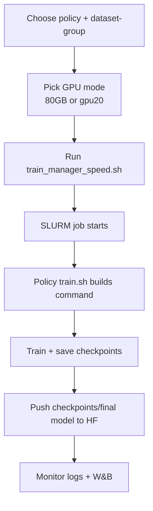

# SPEED Training (short, SBATCH-only)

Use only:
- `mimic_deployment/training_scripts/train_manager_speed.sh`

## Quick start (next time)

```bash
ssh ac_pate@speed.encs.concordia.ca
cd /home/a/ac_pate/mimic-lerobot

source ~/miniconda3/etc/profile.d/conda.sh 2>/dev/null || true
source /speed-scratch/$USER/conda/etc/profile.d/conda.sh 2>/dev/null || true
conda activate lerobot

./mimic_deployment/training_scripts/train_manager_speed.sh \
   --policy xvla \
   --dataset-group ttt_3cam_15hz_32ac \
   --steps 300000 \
   --checkpoint-freq 50000 \
   --batch-size 4 \
   --gpus 1 \
   --slurm-mem 128G
```

## Important options (what they mean)

- `--policy`: policy folder/script to run (`xvla`, `pi05`, `smolvla`, ...)
- `--dataset-group`: key from `dataset_groups.py`
- `--batch-size`: training batch; biggest speed lever before OOM
- `--gpus`: GPUs requested by SLURM (`#SBATCH --gpus`)
- `--slurm-mem`: host RAM for the job (not GPU VRAM)
- `--steps`: total optimization steps
- `--checkpoint-freq`: checkpoint cadence (every N steps)
- `--no-follow`: submit and return immediately
- `--dry-run`: print plan only, no submit
- `--policy-mode`: `default` (normal), `smoke1k`, `maxbatch` (testing-only)

Defaults now:
- `--steps 300000`
- `--checkpoint-freq 50000`

Override example:
```bash
./mimic_deployment/training_scripts/train_manager_speed.sh \
   --policy xvla --dataset-group ttt_3cam_15hz_32ac \
   --steps 500000 --checkpoint-freq 50000 --batch-size 40 --no-follow
```

## Queue monitoring (recommended):
```bash
# Your jobs only
squeue -u "$USER"
squeue -u "$USER" -o '%.9i %.9P %.18j %.8T %.10M %.6D %R'

# One job with reason
squeue -j <jobid> -o "%.9i %.9P %.24j %.8T %.10M %.20R"

# Full pt partition snapshot
squeue -p pt -o "%.9i %.9P %.18j %.8T %.10M %.20R" | head -n 40

# Node states + GPU inventory (pt)
sinfo -p pt -N -h -o '%N %T %G' | head -n 80

# Exact request/reason for one job
scontrol show job <jobid> | egrep -o 'JobState=[^ ]+|Reason=[^ ]+|Partition=[^ ]+|TresPerNode=[^ ]+|StdOut=[^ ]+'
```
## GPU choice (80GB most of the time, 20GB for quick tests)

Default is 80GB GPU (`--gres gpu:nvidia_a100_7g.80gb:1`).

- 80GB run (preferred):
```bash
SLURM_GRES='gpu:nvidia_a100_7g.80gb:1' ./mimic_deployment/training_scripts/train_manager_speed.sh ...
```
- 20GB run (faster queue for tests):
```bash
SLURM_CONSTRAINT='gpu20' ./mimic_deployment/training_scripts/train_manager_speed.sh ...
```

Clean one-line examples:
```bash
SLURM_GRES='gpu:nvidia_a100_7g.80gb:1' ./mimic_deployment/training_scripts/train_manager_speed.sh --policy xvla --dataset-group ttt_3cam_15hz_32ac --steps 300000 --checkpoint-freq 50000 --batch-size 4 --gpus 1 --slurm-mem 128G

SLURM_GRES='' SLURM_CONSTRAINT='gpu20' ./mimic_deployment/training_scripts/train_manager_speed.sh --policy xvla --dataset-group ttt_3cam_15hz_32ac --steps 1000 --checkpoint-freq 1000 --batch-size 4 --gpus 1 --slurm-mem 64G
```

## Validated XVLA batch sizes (ttt_3cam_15hz_32ac)

- Best known stable on `20GB` slice: `batch-size 8`
- Best known stable on `80GB` slice: `batch-size 40`

Use these as defaults for long training runs unless model/dataset settings change significantly.

## Observed SPEED limits (current account/cluster behavior)

- Max wall time used by manager: `3-00:00:00`
- Account cap observed: total `gpu=4`, `cpu=32` across running jobs
- Common stable memory requests used: `128G` / `256G`
- Batch size is model+dataset dependent (no global max)

## Batch-size probing workflow

Normal training (recommended most runs):
```bash
./mimic_deployment/training_scripts/train_manager_speed.sh \
   --policy <policy> --dataset-group <group> \
   --steps 300000 --checkpoint-freq 50000 --batch-size <known-good>
```

Testing-only modes (do not use for regular production runs):

For XVLA (already wired in `xvla/train.sh`):
```bash
./mimic_deployment/training_scripts/train_manager_speed.sh \
   --policy-mode maxbatch \
   --policy xvla --dataset-group ttt_3cam_15hz_32ac --no-follow
```
For Pi 0.5 
```bash
cd /home/a/ac_pate/mimic-lerobot && env SKIP_LOCAL_CONDA_CHECK=true OUTPUT_BASE=/speed-scratch/$USER/mimic-lerobot-outputs SLURM_GRES=gpu:nvidia_a100_7g.80gb:1 SLURM_CONSTRAINT= BATCH_CANDIDATES=44,40,36,32,28,24,20,18 RUN_FINAL_AFTER_PROBE=false PROBE_STEPS=120 ./mimic_deployment/training_scripts/train_manager_speed.sh --policy pi05 --dataset-group ttt_red_3cam_15hz_32ac --policy-mode maxbatch --steps 1000 --checkpoint-freq 1000 --no-follow
```
For other policies (`pi05`, `smolvla`), to find best batch:
1. Start a short run (`--steps 1000`, `--checkpoint-freq 1000`) with an aggressive batch guess.
2. If OOM, lower batch and rerun quickly.
3. Repeat until stable, then keep ~10% safety margin for long runs.
4. Use that final value in normal long training (`300k-500k` steps).

Policy-specific note:
- Keep policy knobs inside each policy folder `mimic_deployment/training_scripts/<policy>/train.sh`.
- Manager should stay generic (policy, dataset, resources, cadence, mode only).

Pending/log note:
- If a job is `PENDING`, the stdout log file may not exist yet; `tail -f` will fail until the job starts.
- Check first with `squeue -j <jobid> -o "%.9i %.9P %.24j %.8T %.10M %.20R"`.


## Conda env routing (automatic by policy)

`train_manager_speed.sh` now auto-selects conda env per policy:

- `xvla` -> `/speed-scratch/$USER/conda/lerobot-xvla`
- `pi05` -> `/speed-scratch/$USER/conda/lerobot-pi`
- others -> `CONDA_ENV_NAME` (default fallback)

Important:
- `lerobot-xvla` is an alias path for the xvla env and is intentionally used by the manager.
- Env package snapshots are stored in:
   - `conda-envs/lerobot-xvla-requirements.txt`
   - `conda-envs/lerobot-pi-requirements.txt`

## W&B / disk quota notes

- If checkpoint logging fails with `OSError: [Errno 122] Disk quota exceeded`, it is usually home quota pressure.
- Manager now exports scratch paths for W&B/temp/cache (`/speed-scratch/$USER/...`) to reduce home usage.
- If needed, clean old local W&B data under `~/.local/share/wandb`.

## Multi-GPU note

- You can request multiple GPUs with `--gpus N`, but with the current manager launch mode (single python process), this does **not** automatically run distributed training.
- In current form, extra GPUs may be reserved without speeding training.
- For true multi-GPU speedup, launch must use distributed workers (e.g., `accelerate launch` / multi-process `srun`).

## Flow (Mermaid)


